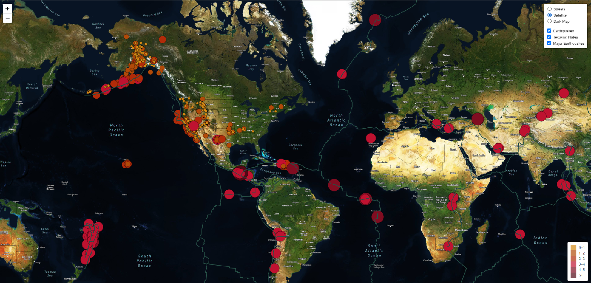
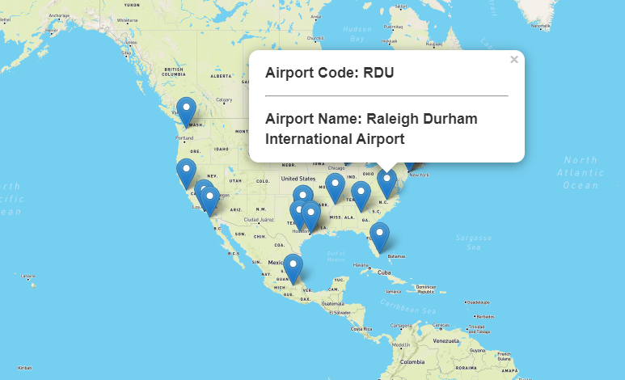
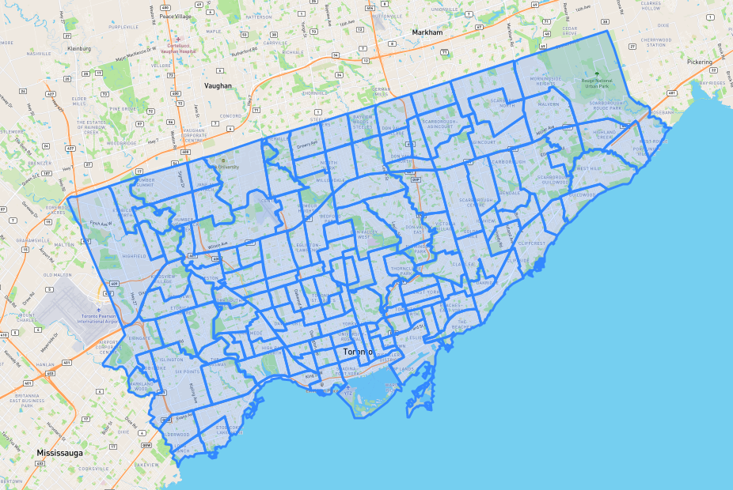

# Mapping_Earthquakes
Visualizing Earthquake Data - Mapping Earthquakes with JavaScript, GeoJSON (Points, Linestrings, Polygons and Non-Spatial Attributes), API, Leafet Library

## Purpose
The purpose of this project is to visually show the differences between the magnitudes of earthquakes all over the world for the last seven days.

## Map Created

## Tasks
Using a URL for GeoJSON earthquake data from the USGS website and retrieve geographical coordinates and the magnitudes of earthquakes for the last seven days. Then add the data to a map.

## Approach
Using JavaScript and D3.js library to retrieve the coordinates and magnitudes of the earthquakes from the GeoJSON data. You'll use the Leaflet library to plot the data on a Mapbox map through an API request and create interactivity for the earthquake data.

Conclusion: Using GeoJSON for mapping is awesome fun. The documentation surrounding Leafet and Geo JSON is easy to understand and has the ability to NOT 'quake' anyone's mind.

### Here is an example using Linestrings: 

### Here is an example using Polygons: 

